# 🏗️ AI Network Configuration Generator - Architecture Diagrams

## 🌐 System Overview

```mermaid
graph TB
    %% User Interface Layer
    subgraph "🖥️ Frontend Layer"
        UI[Web Interface<br/>HTML5 + CSS3 + JS]
        API_CLIENT[AJAX Client<br/>RESTful API Calls]
    end
    
    %% Application Layer
    subgraph "⚙️ Flask Application Layer"
        FLASK[Flask 3.0.0<br/>Web Server]
        ROUTES[API Routes<br/>/api/generate<br/>/api/analyze]
        CORS[CORS Handler<br/>Cross-Origin Support]
    end
    
    %% AI Processing Layer
    subgraph "🧠 AI/NLP Processing Engine"
        NLP[Advanced NLP Engine<br/>AdvancedNLPEntityExtractor]
        SPACY[spaCy 3.6.1<br/>en_core_web_sm]
        REGEX[Regex Fallback<br/>Pattern Matching]
        ENTITIES[Entity Extraction<br/>VLANs, Lines, Protocols]
    end
    
    %% Configuration Generation
    subgraph "🔧 Configuration Generator"
        CONFIG_GEN[IntelligentConfigGenerator<br/>VSI + Traffic Config]
        VSI_GEN[VSI Configuration<br/>Multi-line Support]
        TRAFFIC_GEN[Traffic Generation<br/>Upstream/Downstream]
        PROTOCOL_GEN[Protocol Handling<br/>IPv6, PPPoE]
    end
    
    %% Data Layer
    subgraph "📊 Data Processing"
        PANDAS[pandas 2.0.3<br/>Data Manipulation]
        NUMPY[NumPy 1.24.3<br/>Numerical Computing]
        SKLEARN[scikit-learn 1.3.0<br/>ML Utilities]
    end
    
    %% Deployment
    subgraph "☁️ Deployment"
        GUNICORN[Gunicorn 21.2.0<br/>WSGI Server]
        RENDER[Render.com<br/>Cloud Platform]
    end
    
    %% Connections
    UI --> API_CLIENT
    API_CLIENT --> FLASK
    FLASK --> ROUTES
    ROUTES --> CORS
    ROUTES --> NLP
    NLP --> SPACY
    NLP --> REGEX
    NLP --> ENTITIES
    ENTITIES --> CONFIG_GEN
    CONFIG_GEN --> VSI_GEN
    CONFIG_GEN --> TRAFFIC_GEN
    CONFIG_GEN --> PROTOCOL_GEN
    CONFIG_GEN --> PANDAS
    PANDAS --> NUMPY
    FLASK --> GUNICORN
    GUNICORN --> RENDER
    
    %% Styling
    classDef frontend fill:#e1f5fe,stroke:#01579b,stroke-width:2px
    classDef backend fill:#f3e5f5,stroke:#4a148c,stroke-width:2px
    classDef ai fill:#e8f5e8,stroke:#1b5e20,stroke-width:2px
    classDef config fill:#fff3e0,stroke:#e65100,stroke-width:2px
    classDef data fill:#fce4ec,stroke:#880e4f,stroke-width:2px
    classDef deploy fill:#f1f8e9,stroke:#33691e,stroke-width:2px
    
    class UI,API_CLIENT frontend
    class FLASK,ROUTES,CORS backend
    class NLP,SPACY,REGEX,ENTITIES ai
    class CONFIG_GEN,VSI_GEN,TRAFFIC_GEN,PROTOCOL_GEN config
    class PANDAS,NUMPY,SKLEARN data
    class GUNICORN,RENDER deploy
```



## 🔄 Data Flow Architecture

```mermaid
flowchart TD
    %% Input Processing
    START([👤 User Input<br/>Natural Language])
    
    %% NLP Pipeline
    subgraph "🧠 NLP Processing Pipeline"
        PREPROCESS[Text Preprocessing<br/>Cleaning & Normalization]
        SPACY_CHECK{spaCy Available?}
        SPACY_NLP[spaCy Processing<br/>Advanced Entity Recognition]
        REGEX_NLP[Regex Processing<br/>Pattern Matching Fallback]
        EXTRACT[Entity Extraction<br/>VLANs, Lines, Services, PBITs]
    end
    
    %% Configuration Generation
    subgraph "⚙️ Configuration Generation"
        ANALYZE[Analyze Entities<br/>Determine Configuration Type]
        SINGLE_LINE{Single Line?}
        MULTI_LINE{Multi Line?}
        MULTI_SERVICE{Multi Service?}
        
        SINGLE_CONFIG[Generate Single Line Config<br/>UserVSI + NetworkVSI + Forwarder]
        MULTI_CONFIG[Generate Multi Line Config<br/>Multiple VSI pairs]
        SERVICE_CONFIG[Generate Multi Service Config<br/>Service multiplexing]
    end
    
    %% Traffic Generation
    subgraph "🚦 Traffic Configuration"
        TRAFFIC_TYPE{Traffic Type?}
        UPSTREAM[Upstream Traffic<br/>User → Network]
        DOWNSTREAM[Downstream Traffic<br/>Network → User]
        BIDIRECTIONAL[Bidirectional Traffic<br/>Both Directions]
        PROTOCOL_ADD[Add Protocol Headers<br/>IPv6, PPPoE if detected]
    end
    
    %% Output
    COMBINE[Combine Configurations<br/>VSI + Traffic]
    OUTPUT([📄 Generated Configuration<br/>Ready for Deployment])
    
    %% Error Handling
    ERROR_HANDLE[Error Handling<br/>Graceful Fallbacks]
    
    %% Flow Connections
    START --> PREPROCESS
    PREPROCESS --> SPACY_CHECK
    SPACY_CHECK -->|Yes| SPACY_NLP
    SPACY_CHECK -->|No| REGEX_NLP
    SPACY_NLP --> EXTRACT
    REGEX_NLP --> EXTRACT
    EXTRACT --> ANALYZE
    
    ANALYZE --> SINGLE_LINE
    ANALYZE --> MULTI_LINE
    ANALYZE --> MULTI_SERVICE
    
    SINGLE_LINE -->|Yes| SINGLE_CONFIG
    MULTI_LINE -->|Yes| MULTI_CONFIG
    MULTI_SERVICE -->|Yes| SERVICE_CONFIG
    
    SINGLE_CONFIG --> TRAFFIC_TYPE
    MULTI_CONFIG --> TRAFFIC_TYPE
    SERVICE_CONFIG --> TRAFFIC_TYPE
    
    TRAFFIC_TYPE --> UPSTREAM
    TRAFFIC_TYPE --> DOWNSTREAM
    TRAFFIC_TYPE --> BIDIRECTIONAL
    
    UPSTREAM --> PROTOCOL_ADD
    DOWNSTREAM --> PROTOCOL_ADD
    BIDIRECTIONAL --> PROTOCOL_ADD
    
    PROTOCOL_ADD --> COMBINE
    COMBINE --> OUTPUT
    
    %% Error paths
    PREPROCESS -.-> ERROR_HANDLE
    EXTRACT -.-> ERROR_HANDLE
    ANALYZE -.-> ERROR_HANDLE
    ERROR_HANDLE -.-> OUTPUT
    
    %% Styling
    classDef input fill:#e3f2fd,stroke:#0277bd,stroke-width:3px
    classDef nlp fill:#e8f5e8,stroke:#2e7d32,stroke-width:2px
    classDef config fill:#fff8e1,stroke:#f57c00,stroke-width:2px
    classDef traffic fill:#fce4ec,stroke:#c2185b,stroke-width:2px
    classDef output fill:#f3e5f5,stroke:#7b1fa2,stroke-width:3px
    classDef decision fill:#ffebee,stroke:#d32f2f,stroke-width:2px
    classDef error fill:#ffebee,stroke:#d32f2f,stroke-width:1px,stroke-dasharray: 5 5
    
    class START,OUTPUT input
    class PREPROCESS,SPACY_NLP,REGEX_NLP,EXTRACT nlp
    class ANALYZE,SINGLE_CONFIG,MULTI_CONFIG,SERVICE_CONFIG config
    class TRAFFIC_TYPE,UPSTREAM,DOWNSTREAM,BIDIRECTIONAL,PROTOCOL_ADD traffic
    class SPACY_CHECK,SINGLE_LINE,MULTI_LINE,MULTI_SERVICE decision
    class ERROR_HANDLE error
    class COMBINE output
```



## 🌐 Web Application Flow


## 🏗️ Technical Stack Architecture


## 🔧 Configuration Generation Process

```mermaid
flowchart TD
    %% Input Analysis
    INPUT[📝 Natural Language Input<br/>"Configure DUT with VLAN 100"]
    
    %% Entity Extraction
    subgraph "🧠 Entity Extraction"
        PARSE[Text Parsing & Cleaning]
        VLAN_DETECT[VLAN Detection<br/>100, 200, etc.]
        LINE_DETECT[Line Detection<br/>Line1, Line2, etc.]
        SERVICE_DETECT[Service Detection<br/>1:1, N:1, Multi-service]
        PBIT_DETECT[PBIT Detection<br/>Priority bits]
        PROTOCOL_DETECT[Protocol Detection<br/>IPv6, PPPoE]
    end
    
    %% Configuration Logic
    subgraph "⚙️ Configuration Logic"
        CONFIG_TYPE{Configuration Type?}
        
        SINGLE[Single Line Config<br/>1 UserVSI + 1 NetworkVSI]
        MULTI[Multi Line Config<br/>Multiple VSI pairs]
        SERVICES[Multi Service Config<br/>Service multiplexing]
        
        VSI_BUILD[Build VSI Configuration<br/>VLAN assignment + Parent links]
        FORWARDER_BUILD[Build Forwarder Rules<br/>1:1 or N:1 mapping]
    end
    
    %% Traffic Generation
    subgraph "🚦 Traffic Generation"
        TRAFFIC_BUILD[Build Traffic Configuration]
        
        UPSTREAM_BUILD[Upstream Traffic<br/>User → Network]
        DOWNSTREAM_BUILD[Downstream Traffic<br/>Network → User]
        
        PACKET_BUILD[Packet Header Generation<br/>MAC, VLAN, PBIT]
        PROTOCOL_BUILD[Protocol Header Addition<br/>IPv6, PPPoE if needed]
    end
    
    %% Output Assembly
    ASSEMBLE[🔧 Assemble Final Configuration]
    OUTPUT_FINAL[📋 Complete Configuration<br/>Ready for deployment]
    
    %% Flow
    INPUT --> PARSE
    PARSE --> VLAN_DETECT
    PARSE --> LINE_DETECT
    PARSE --> SERVICE_DETECT
    PARSE --> PBIT_DETECT
    PARSE --> PROTOCOL_DETECT
    
    VLAN_DETECT --> CONFIG_TYPE
    LINE_DETECT --> CONFIG_TYPE
    SERVICE_DETECT --> CONFIG_TYPE
    
    CONFIG_TYPE -->|Single Line| SINGLE
    CONFIG_TYPE -->|Multiple Lines| MULTI
    CONFIG_TYPE -->|Multiple Services| SERVICES
    
    SINGLE --> VSI_BUILD
    MULTI --> VSI_BUILD
    SERVICES --> VSI_BUILD
    
    VSI_BUILD --> FORWARDER_BUILD
    FORWARDER_BUILD --> TRAFFIC_BUILD
    
    TRAFFIC_BUILD --> UPSTREAM_BUILD
    TRAFFIC_BUILD --> DOWNSTREAM_BUILD
    
    UPSTREAM_BUILD --> PACKET_BUILD
    DOWNSTREAM_BUILD --> PACKET_BUILD
    
    PACKET_BUILD --> PROTOCOL_BUILD
    PROTOCOL_BUILD --> ASSEMBLE
    
    PBIT_DETECT --> PACKET_BUILD
    PROTOCOL_DETECT --> PROTOCOL_BUILD
    
    ASSEMBLE --> OUTPUT_FINAL
    
    %% Styling
    classDef input fill:#e3f2fd,stroke:#1565c0,stroke-width:3px
    classDef extraction fill:#e8f5e8,stroke:#2e7d32,stroke-width:2px
    classDef logic fill:#fff8e1,stroke:#f9a825,stroke-width:2px
    classDef traffic fill:#fce4ec,stroke:#c2185b,stroke-width:2px
    classDef output fill:#f3e5f5,stroke:#8e24aa,stroke-width:3px
    classDef decision fill:#ffebee,stroke:#d32f2f,stroke-width:2px
    
    class INPUT input
    class PARSE,VLAN_DETECT,LINE_DETECT,SERVICE_DETECT,PBIT_DETECT,PROTOCOL_DETECT extraction
    class SINGLE,MULTI,SERVICES,VSI_BUILD,FORWARDER_BUILD logic
    class TRAFFIC_BUILD,UPSTREAM_BUILD,DOWNSTREAM_BUILD,PACKET_BUILD,PROTOCOL_BUILD traffic
    class ASSEMBLE,OUTPUT_FINAL output
    class CONFIG_TYPE decision
```

## 📊 Performance & Metrics Dashboard


---

*These diagrams provide a comprehensive visual explanation of your AI-powered Network Configuration Generator system architecture and capabilities! 🚀*
